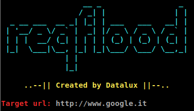

# reqflood

An HTTP requests flooder made in Python.

## Features
- Send GET and POST requests
- Send requests with a delay
- Limit request number

# Installation
1. Clone the repository with: `git clone https://github.com/Datalux/reqflood`
2. (**OPTIONAL**) create a command to directly execute script. In your bash profile add following line:
`alias reqflood='<YOUR-PATH>/reqflood/main.py'` where in `<YOUR-PATH>` insert path where you cloned the repository

